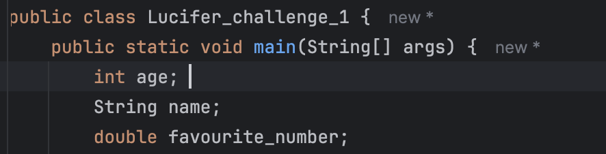
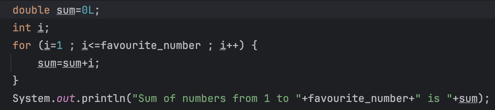
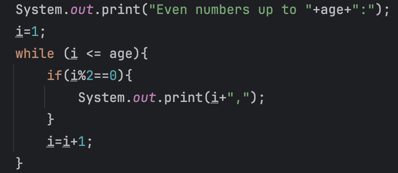
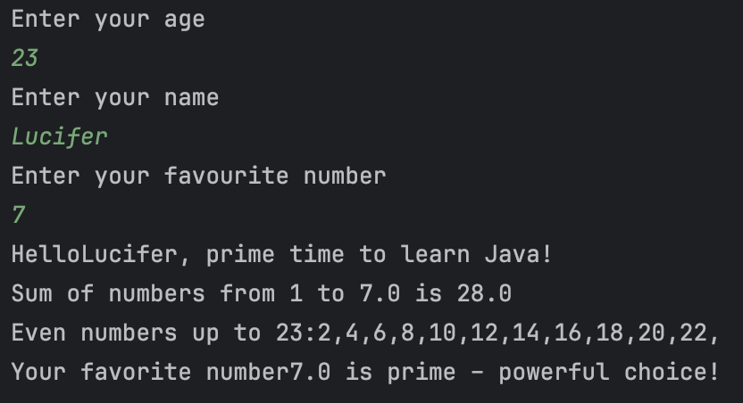

# JAVA-CHALLENGE#1: Advanced Console Application

GOALS:

**Objective:** Combine environment setup, Java syntax, variables, and control flow into one cohesive program.

**Challenge Description:**

Create a Java program named LuciferChallenge.java that does the following:

1. **User Interaction & Variables:**
    - Ask the user for their **name**, **age**, and **favorite number**.
    - Store the inputs in appropriate data types (String, int, double).
2. **Conditional Logic:**
    - If the user is **under 18**, print: "Hello [name], you're a young coder!"
    - If the user is **18–50**, print: "Hello [name], prime time to learn Java!"
    - If the user is **over 50**, print: "Hello [name], wisdom meets code!"
3. **Loops & Computation:**
    - Using a **for loop**, calculate and print the **sum of numbers from 1 to their favorite number**.
    - Using a **while loop**, print all even numbers from 2 up to the user’s age.
4. **Extra Twist (Optional for Hardcore):**
    - If the favorite number is **prime**, print: "Your favorite number [number] is prime – powerful choice!"

**Example Output:**

```
Enter your name: Lucifer
Enter your age: 23
Enter your favorite number: 7

Hello Lucifer, prime time to learn Java!
Sum of numbers from 1 to 7 is 28
Even numbers up to 22: 2, 4, 6, 8, 10, 12, 14, 16, 18, 20, 22
Your favorite number 7 is prime – powerful choice!
```

### **User Interaction & Variables:**

1.first of all lets declare variables that we will need String **name**,int **age**, and double **favorite number**.



lets put scanner to read from stdin


and now lets go for if else logic

before and to not be redundant 
`System.*out*.println("Hello"+name);`


lets now create new variables



- we should do a sum of double because by creating a double variable sum = 0
- int i for the loop
    
    
    
- Using a **while loop**, print all even numbers from 2 up to the user’s age.

and finally


and here we goo



all the goals are achieved successfully